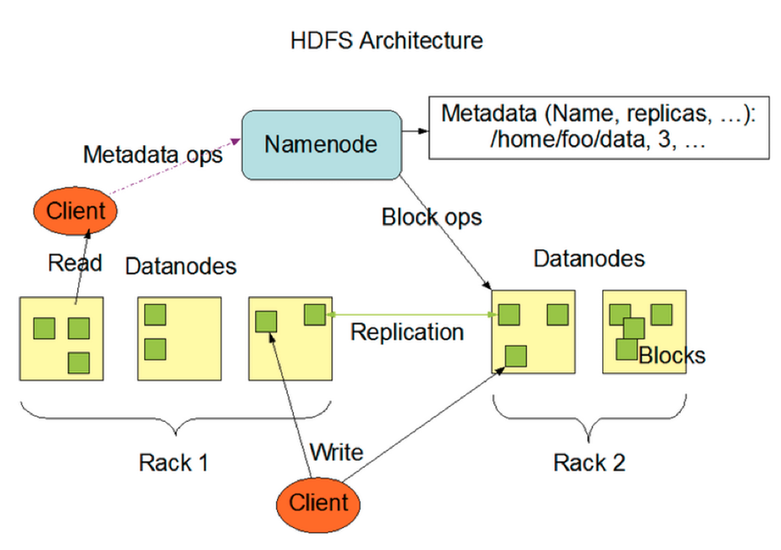

# 分散式檔案系統 HDFS
Hadoop 是一個**叢集系統**（cluster system），也就是由單一伺服器擴充到數以千計的機器，整合應用起來像是一台超級電腦。而資料存放在這個叢集中的方式則是採用 **HDFS 分散式檔案系統**（Hadoop Distributed File System）。
* 簡稱HDFS。
* 在分散式儲存環境中，提供單一的目錄系統。
* 資料以Write-once-read-many存取，一旦建立、寫入，就不允許修改。
* 每個檔案被分割成許多block，每個block複製許多複本(replica)，並分散儲存於不同的DataNode上。
* NameNode：負責維護HDFS的檔案名稱空間 (File System Namespace)。
* DataNode：實際儲存檔案區塊(Blocks)的伺服器。

#### HDFS 設計概念
叢集系統中有數以千計的節點用來存放資料，如果把一份檔案想成一份藏寶圖，機器中會有一個機器老大（Master Node）跟其他機器小弟（Slave/Worker Node），為了妥善保管藏寶圖，先將它分割成數小塊（block），通常每小塊的大小是 64 MB，而且把每小塊拷貝成三份（Data replication），再將這些小塊分散給小弟們保管。機器小弟們用「DataNode」這個程式來放藏寶圖，機器老大則用「NameNode」這個程式來監視所有小弟們藏寶圖的存放狀態。

NameNode 發現有哪個 DataNode 上的藏寶圖遺失或遭到損壞（例如某位小弟不幸陣亡，順帶藏寶圖也丟了），就會尋找其他 DataNode 上的副本（Replica）進行複製，保持每小塊的藏寶圖在整個系統都有三份的狀態，這樣便萬無一失。

