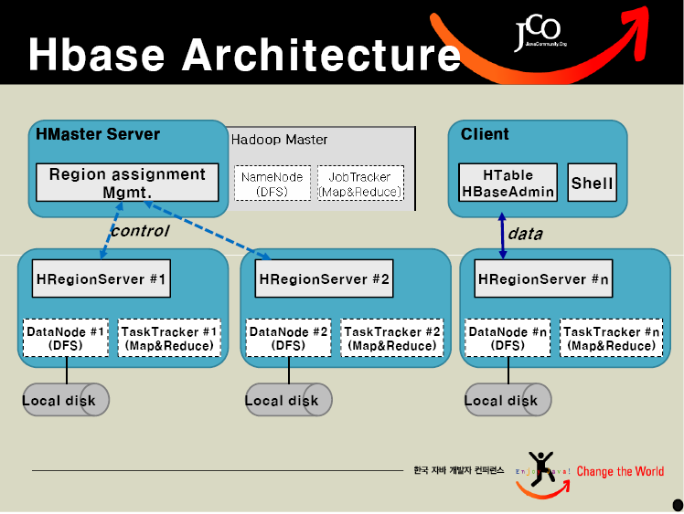

# HBase
HBase是專門用於Hadoop檔案系統上的資料庫系統，採取Column-Oriented 資料庫設計，不同於傳統的關聯式資料庫，例如沒有資料表、Schema資料架構等功能，而是採用Key-Value形式的資料架構，每筆資料都有一個Key值對應到一個Value值，再透過多維度的對應關係來建立類似表格效果的資料架構。如此就能採取分散式儲存方式，可以擴充到數千臺伺服器，以應付PB等級的資料處理。

### What is HBase?
* 以 Hadoop 的 HDFS 為基礎， 提供類 Bigtable 功能。
* 類似表格的資料結構。
* 適用於數量龐大的一般伺服器上，來儲存Petabytes級的資料。
* 不是關聯式(Relational)資料庫系統。
* 表格(Table)只有一個主要索引 (primary index) 即 row key。
* 不提供 join。
* 不提供 SQL語法。



### HBase Shell
* 開啟 HBase Shell


* 建立 table

|     |cf|
| --  | -- | --    |
|row1 | a | value1 |
|row2 | b | value2 |
|row3 | c | value3 |

* table 名稱 test ，只有 1 個列 cf
* cf 內有 3 個屬性，分別為 row1、row2、row3
* a、b、c裡的值分別為 value1、value2、value3


```
create 'test', 'cf'

```


*
加入數值


```
put 'test', 'row1', 'cf:a', 'value1'

put 'test', 'row2', 'cf:b', 'value2'

put 'test', 'row3', 'cf:c', 'value3'
```


*
查看table 內容

```
scan 'test'
```


* get 數值

```
get 'test', 'row1'

```

 


 * 刪除 table 要先disable在drop

```
disable 'test'

drop 'test'

```


 * 關閉 HBase Shell

```
exit

```

 參考

 http://kurthung1224.pixnet.net/blog/post/195564661-hbase-shell%E6%8C%87%E4%BB%A4-%E7%B0%A1%E5%96%AE%E7%B7%B4%E7%BF%92


 http://www.ithome.com.tw/node/73980
