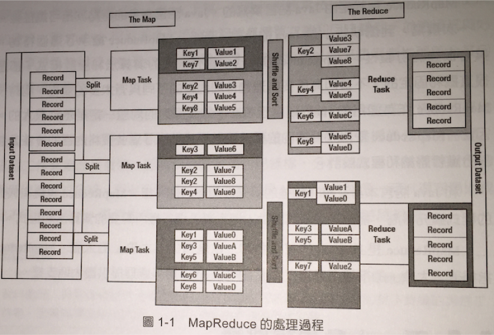
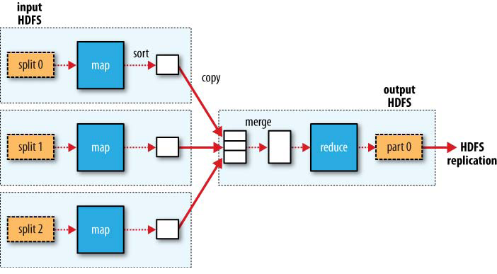

# MapReduce 平行運算架構
#### 何謂MapReduce?

* 是一種軟體框架(software framework)
* 這個軟體框架由Google實作出
* 運行在眾多不可靠電腦組成的叢集(clusters)上
* 能為大量資料做平行運算處理
* 此框架的功能概念主要是映射(Map)和化簡(Reduce)兩種
* 實作上可用C++、JAVA或其他程式語言來達成

#### 何謂映射(Map)?
從主節點(master node)輸入一組input，此input是一組key/value，將這組輸入切分成好幾個小的子部分，分散到各個工作節點(worker nodes)去做運算。

#### 何謂化簡(Reduce)?
主節點(master node)收回處理完的子部分，將子部分重新組合產生輸出。

#### MapReduce的Dataflow
* Input reader
* Map function
* Partition function
* Comparison function
* Reduce function
* Output writer

#### MapReduce 程式的執行過程如下：
1. 將要執行的 MapReduce 程式複製到 Master 與每一臺 Worker 機器中。
2. Master 決定 Map 程式與 Reduce 程式，分別由哪些 Worker 機器執行。
3. 將所有的資料區塊，分配到執行 Map 程式的 Worker 機器中進行 Map。
4. 將 Map 後的結果存入 Worker 機器的本地磁碟。
5. 執行 Reduce 程式的 Worker 機器，遠端讀取每一份 Map結果，進行彙整與排序，同時執行 Reduce 程式。
6. 將使用者需要的運算結果輸出。
