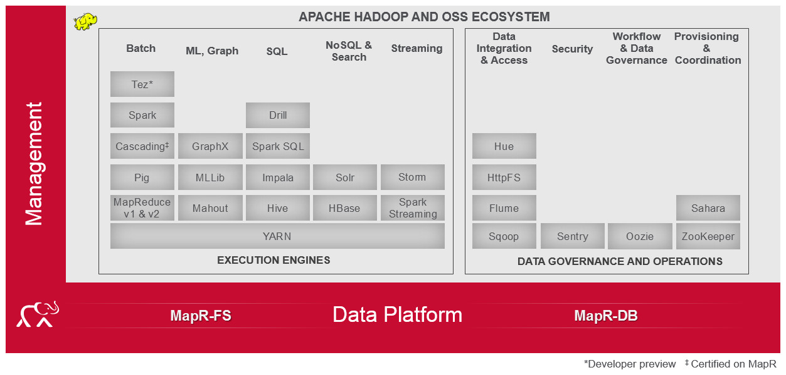

# Hadoop 技術

Apache Hadoop是一款支持資料密集型分佈式應用，並以Apache 2.0許可協議發佈的開源軟體框架。它支援在硬體建構的大型叢集上執行的應用程式。

* 本來是Apache.org在Lucene下的一個專案，由Dong Cutting所開發。
* 用來處理與保存大量資料的雲端運算平台。
* Apache top-level 專案。
* 是一個開放源始碼的分散式計算系統的JAVA實作，可協助處理大規模的資料集(Data Sets)。
* 一套實現Google Map Reduce及GFS(Google File System)的工具
* Map就是將一個工作分到多個Node。
* Reduce就是將各個Node的結果再重新結合成最後的結果。
* 運算的部分以Map Reduce為架構。
* 特色：分散式運算、運算加速、運算節點備份、具穩定性。
* 使用的檔案系統：HDFS。
* 使用的儲存系統：Hbase。

# Hadoop Ecosystem

Apache基金會規畫的Hadoop體系中還有許多武功高強的周邊專案，如可支援SQL語法的Hive，不懂Java也能撰寫MapReduce的Pig，這些都是開發者不能錯過的Hadoop相關專案
####  MapReduce
概念「Map（映射）」和「Reduce（歸納）」，及他們的主要思想，都是從函數式程式語言借來的，還有從矢量程式語言借來的特性。

####  HDFS
Hadoop 是一個叢集系統（cluster system），也就是由單一伺服器擴充到數以千計的機器，整合應用起來像是一台超級電腦。

#### HBase
HBase是專門用於Hadoop檔案系統上的資料庫系統，採取Column-Oriented 資料庫設計，不同於傳統的關聯式資料庫，例如沒有資料表、Schema資料架構等功能，而是採用Key-Value形式的資料架構，每筆資料都有一個Key值對應到一個Value值，再透過多維度的對應關係來建立類似表格效果的資料架構。如此就能採取分散式儲存方式，可以擴充到數千臺伺服器，以應付PB等級的資料處理。

####  Hive
Hive是建置在HDFS上的一套分散式資料倉儲系統，可讓使用者以慣用的SQL語法，來存取Hadoop檔案中的大型資料集，例如可以使用Join、Group by、Order by等，而這個語法稱為Hive QL。不過，Hive QL和SQL並非完全相同，例如Hive就不支援Store Procedure、Trigger等功能。

Hive會將使用者輸入的Hive QL指令編譯成Java程式，再來存取HDFS檔案系統上的資料，所以，執行效率依指令複雜度和處理的資料量而異，可能有數秒鐘，甚至是數分鐘的延遲。和HBase相比，Hive容易使用且彈性高，但執行速度較慢。不少資料庫系統，都是透過先連結到Hive，才能與Hadoop整合。例如微軟就是透過Hive ODBC驅動程式，將SQL指令轉換成Hive QL，讓Excel可以存取Hadoop上的資料。

在同一個Hadoop叢集中，Hive可以存取HBase上的資料，將HBase上的資料對應成Hive內的一個表格。

#### Pig
Pig提供了一個Script語言Pig Latin，語法簡單，類似可讀性高的高階Basic語言，可用來撰寫MapReduce程式。Pig會自動將這些腳本程式轉換，成為能在Hadoop中執行的MapReduce Java程式。

因此，使用者即使不懂Java也能撰寫出MapReduce。不過，一般來說，透過Pig腳本程式轉換，會比直接用Java撰寫MapReduce的效能降低了25％。

#### ZooKeeper
Zookeeper是監控和協調Hadoop分散式運作的集中式服務，可提供各個伺服器的配置和運作狀態資訊，用於提供不同Hadoop系統角色之間的工作協調。

以HBase資料庫為例，其中有兩種伺服器角色：Region伺服器角色和Master伺服器角色，系統會自動透過ZooKeeper監看Master伺服器的狀態，一旦Master的運作資訊消失，代表當機或網路斷線，HBase就會選出另一臺Region伺服器成為Mater角色來負責管理工作。

#### Mahout
在Hadoop中，開發人員必須將資料處理作法拆解成可分散運算的Map和Reduce程式，因為思考邏輯和常見的程式開發邏輯不同，所以開發難度很高。Mahout則提供了一個常用的MapReduce函式庫，常見的數值分析方法、叢集分類和篩選方式，都已經有對應的MapReduce函數可呼叫，開發人員就不必再重複開發一次。

